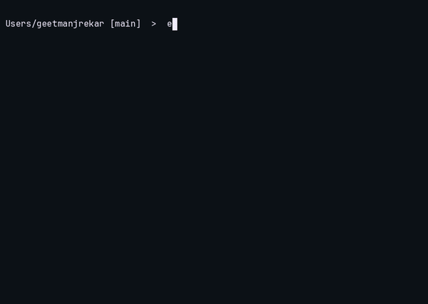

# POSIX shell

A POSIX-style shell written from scratch in C++17. Process management, job control, and line editing are built directly on Unix syscalls — no shell libraries.



## Features

**Execution**

- `fork()` / `execvp()` command execution
- Pipelines — `ls | grep .cpp | wc -l`
- Redirection — `>`, `>>`, `<`
- Glob expansion via `glob()`
- Quoting and escaping
- Command chaining

**Job control**

- Background execution with `&`, plus `jobs`, `fg`, `bg`
- `Ctrl+Z` suspend and resume
- `Ctrl+C` kills the foreground job, not the shell
- Process groups and terminal ownership (`setpgid`, `tcsetpgrp`)

**Shell environment**

- Variables — `var=value`, `$var` expansion, `export`
- Exit status tracking, including the `128+signal` convention
- `alias` / `unalias`
- Basic scripting: control flow and running script files

**Line editing**

- readline integration: history, editing, tab completion over builtins and `$PATH`
- Git-aware prompt showing the current branch

## Build

Requires GNU readline (not the macOS-default libedit).

```sh
brew install readline

clang++ -std=c++17 \
  -I/opt/homebrew/opt/readline/include \
  -L/opt/homebrew/opt/readline/lib \
  -lreadline shell.cpp -o shell

./shell
```

Or with the included Makefile:

```sh
make run
```
